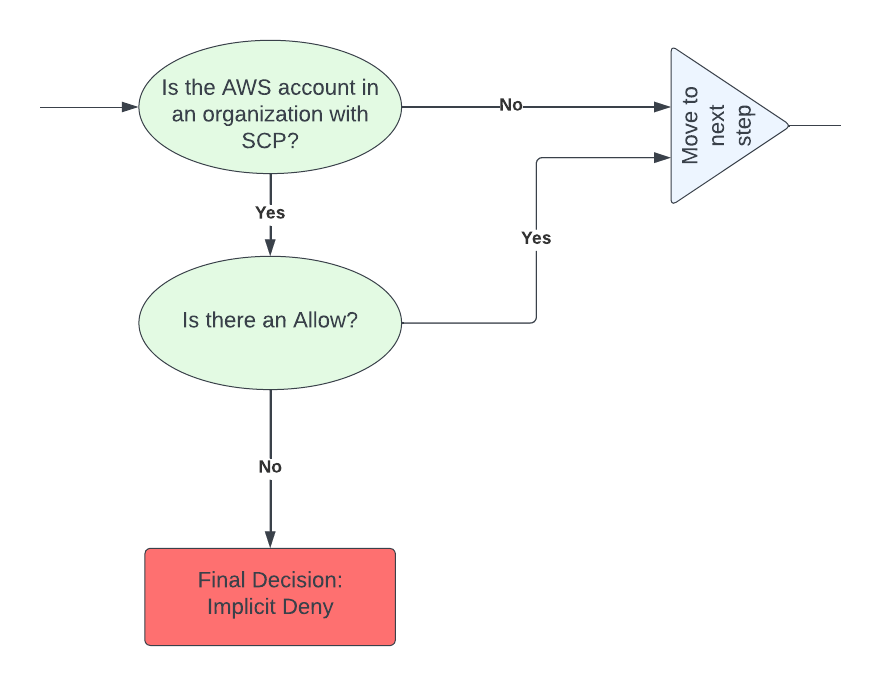

# AWS SCPs
Service control policies (SCPs) are meant to be used as coarse-grained guardrails, and they don’t directly grant access. The administrator must still attach identity-based or resource-based policies to IAM principals or resources in your accounts to actually grant permissions. The effective permissions are the logical intersection between what is allowed by the SCP and what is allowed by the IAM and resource-based policies. You can get more details about SCP effects on permissions here.
### SCP Evaluation Logic:


# aws-scp-examples
AWS SCPs Examples:

1. `Deny Account Region Enable and Disable Actions:`

```json
{
    "Version": "2012-10-17",
    "Statement": [
        {
            "Effect": "Deny",
            "Action": [
                "account:EnableRegion",
                "account:DisableRegion"
            ],
            "Resource": "*",
            "Condition": {
                "ArnNotLike": {
                    "aws:PrincipalARN": "arn:aws:iam::${Account}:role/[PRIVILEGED_ROLE]"
                }
            }
        }
    ]
}
```
---
2. `Deny Users from Modifying S3 Block Public Access:`

```json
{
    "Version": "2012-10-17",
    "Statement": [
        {
            "Effect": "Deny",
            "Action": [
                "s3:PutAccountPublicAccessBlock"
            ],
            "Resource": "*",
            "Condition": {
                "ArnNotLike": {
                    "aws:PrincipalARN": "arn:aws:iam::${Account}:role/[PRIVILEGED_ROLE]"
                }
            }
        }
    ]
}
```
---
3. `Deny Leave Organization:`

The following policy blocks use of the LeaveOrganization API operation so that administrators of member accounts can't remove their accounts from the organization.


```json
{
    "Version": "2012-10-17",
    "Statement": [
        {
            "Effect": "Deny",
            "Action": [
                "organizations:LeaveOrganization"
            ],
            "Resource": "*"
        }
    ]
}
```
---

4. `Deny Service Access For Root User:`

The following policy restricts all access to the specified actions for the root user in a member account. If you want to prevent your accounts from using root credentials in specific ways, add your own actions to this policy.
```json
{
    "Version": "2012-10-17",
    "Statement": [
      {
        "Sid": "RestrictEC2ForRoot",
        "Effect": "Deny",
        "Action": [
          "ec2:*"
        ],
        "Resource": [
          "*"
        ],
        "Condition": {
          "StringLike": {
            "aws:PrincipalArn": [
              "arn:aws:iam::*:root"
            ]
          }
        }
      }
    ]
  }
  
```
---
5. `Deny ability to create IAM access keys:`

In order to avoid having long lived credentials that never expire which can end up being exposed, some companies ban access keys entirely. This policy denies the ability to create IAM users and access keys.

```json
{
    "Version": "2012-10-17",
    "Statement": {
        "Effect": "Deny",
        "Action": ["iam:CreateAccessKey", "iam:CreateUser"],
        "Resource": "*"
    }
}
```
---
6. `Deny Access To A Specific Role:`

This policy can be used to deny modifications of an incident response or other security auditing role.

```json
{    
  "Version": "2012-10-17",
  "Statement": [
    {
      "Sid": "DenyAccessToASpecificRole",
      "Effect": "Deny",
      "Action": [
        "iam:AttachRolePolicy",
        "iam:DeleteRole",
        "iam:DeleteRolePermissionsBoundary",
        "iam:DeleteRolePolicy",
        "iam:DetachRolePolicy",
        "iam:PutRolePermissionsBoundary",
        "iam:PutRolePolicy",
        "iam:UpdateAssumeRolePolicy",
        "iam:UpdateRole",
        "iam:UpdateRoleDescription"
      ],
      "Resource": [
        "arn:aws:iam::*:role/CHANGEME"
      ]
    }
  ]
}
```
7. `Restrict Regions: `

The following policy enforces that only `ap-southeast-2` can be used, along with the global services. Be aware that if you use Lambda@Edge, you might need to adjust your code, or this policy, as you’ll likely end up making calls in other regions as the Lambdas that are run will default to making calls in the closest region to the distribution’s point of presence.

```json
{
    "Version": "2012-10-17",
    "Statement": [
        {
            "Sid": "RestrictRegion",
            "Effect": "Deny",
            "NotAction": [
                "a4b:*",
                "budgets:*",
                "ce:*",
                "chime:*",
                "cloudfront:*",
                "cur:*",
                "globalaccelerator:*",
                "health:*",
                "iam:*",
                "importexport:*",
                "mobileanalytics:*",
                "organizations:*",
                "route53:*",
                "route53domains:*",
                "shield:*",
                "support:*",
                "trustedadvisor:*",
                "waf:*",
                "wellarchitected:*"
            ],
            "Resource": "*",
            "Condition": {
                "StringNotEquals": {
                    "aws:RequestedRegion": [
                        "ap-southeast-2"
                    ]
                }
            }
        }
    ]
}
```
